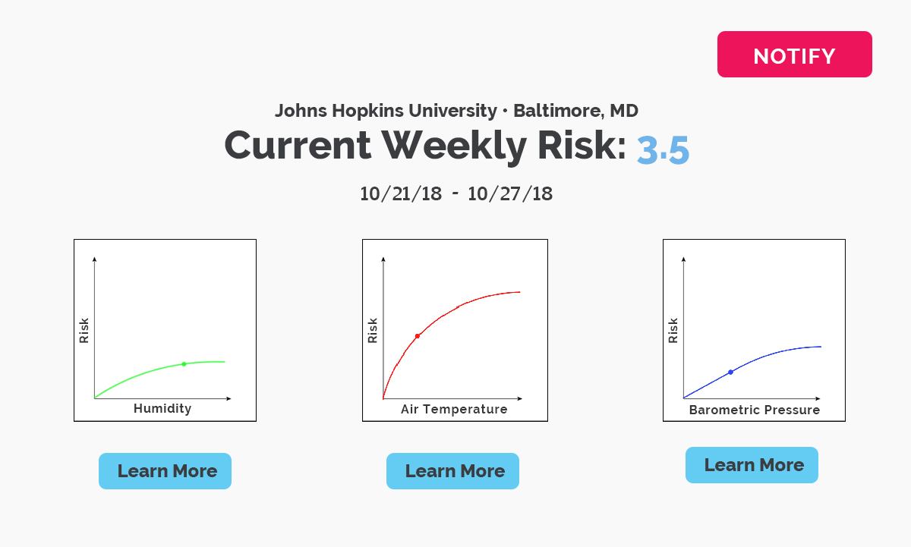
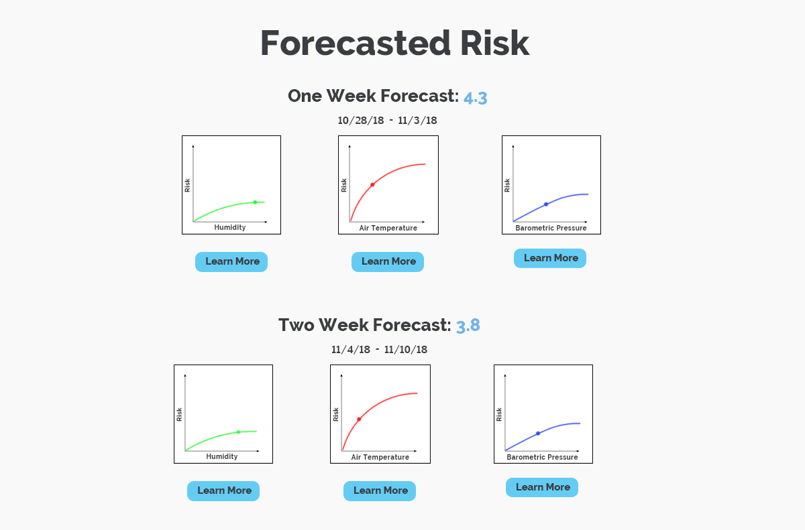

# ProApt

### ProApt is a web application which enables college administrators to forecast the current risk of disease outbreak on campus as well as share this information with the student body.

	
    

#### About

To create ProApt our group used machine learning algorithms to identify patterns in disease outbreaks in micro-communities using various environmental factors. Our ML algorithms were trained using data across all US states between 2013-2017. This included NASA's GLOBE data regarding humidity, barometric pressure and air temperature, as well as CDC data regarding the intensity of disease outbreaks. After training, we were then able to use our model to predict the risk of an outbreak given local environmental conditions. This model can then be used to notify and warn college administrators when conditions on campus are prime for a disease outbreak. ProApt also serves as a streamlined communication platform, enabling college administrator to share risk assessment information and possible mitigation techniques with the entire student body.

We used random forest regression to inform differential models of disease spread. This was used to accurately predict disease incidence over the next 100 days. Random forest regression was used for the ML algorithm. See predict_data.py to view runner. ML was done in analysis_mk2.py.

All other files were used for data analysis. A k-d tree was used for clustering of location data for the purpose of associating CDC and GLOBE data.

#### Resources Used:

Globe Data - https://datasearch.globe.gov/

CDC Data - https://www.cdc.gov/hai/data/portal/index.html

Created for SpaceApps Challenge 2018
